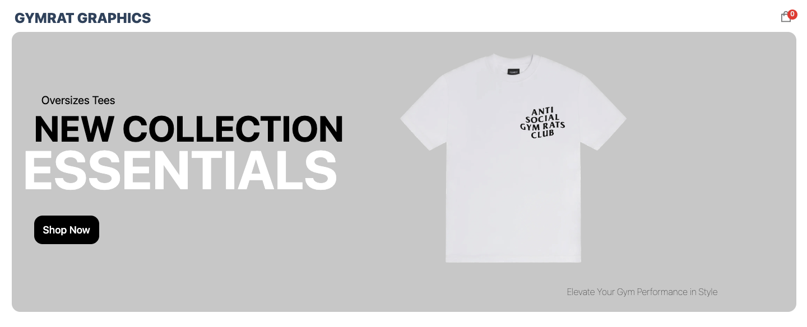
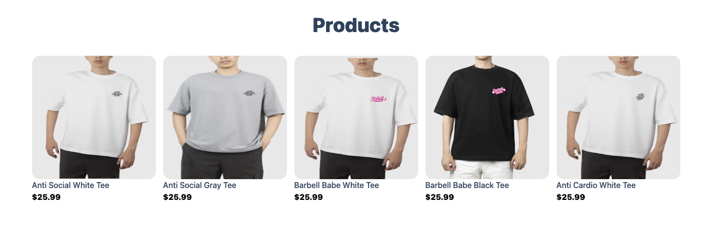
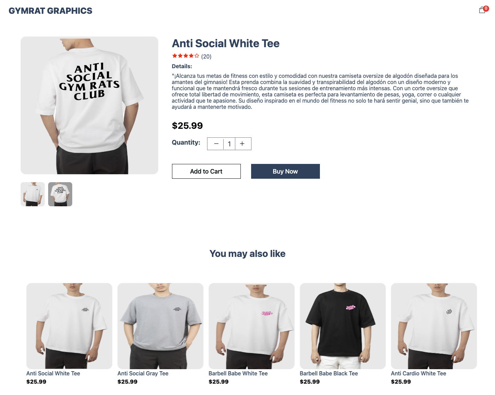
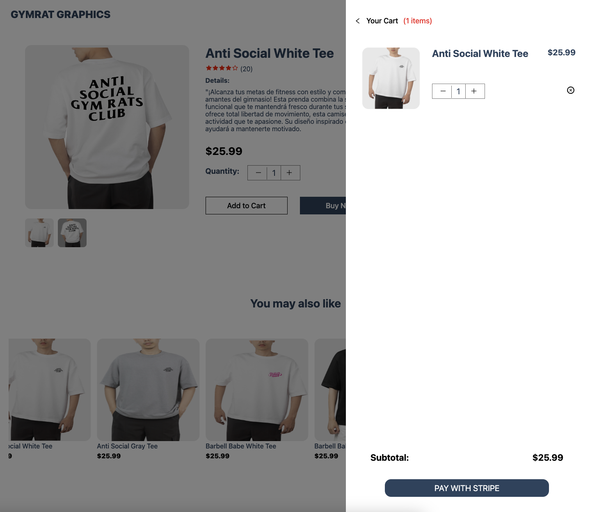
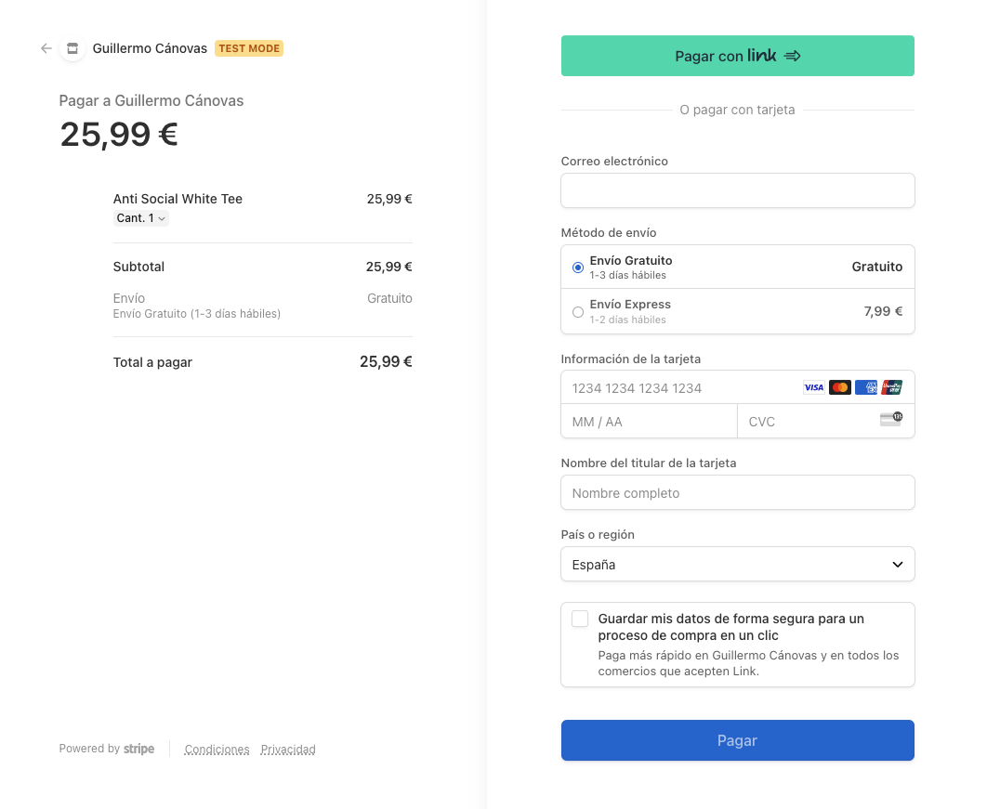
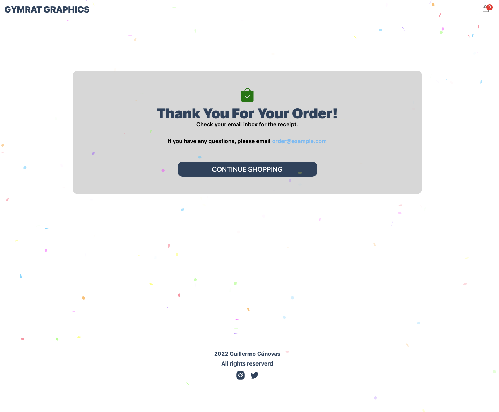

# Online Store

This is a project of an online store developed in React that allows users to make purchases through Stripe payments.

## Features

- Display of available T-shirts.
- Adding T-shirts to the shopping cart.
- Processing payments with Stripe.
- Order confirmation with order details.

## Screenshots

## Demo

You can see the application in action [here](https://ecommerce-app-one-gilt.vercel.app/).

